---
## Front matter
title: "Отчёт по лабораторной работе № 3"
subtitle: "Операционные системы"
author: "Паулу Антонью Жоау"

## Generic otions
lang: ru-RU
toc-title: "Содержание"

## Bibliography
bibliography: bib/cite.bib
csl: pandoc/csl/gost-r-7-0-5-2008-numeric.csl

## Pdf output format
toc: true # Table of contents
toc-depth: 2
lof: true # List of figures
fontsize: 12pt
linestretch: 1.5
papersize: a4
documentclass: scrreprt
## I18n polyglossia
polyglossia-lang:
  name: russian
  options:
	- spelling=modern
	- babelshorthands=true
polyglossia-otherlangs:
  name: english
## I18n babel
babel-lang: russian
babel-otherlangs: english
## Fonts
mainfont: PT Serif
romanfont: PT Serif
sansfont: PT Sans
monofont: PT Mono
mainfontoptions: Ligatures=TeX
romanfontoptions: Ligatures=TeX
sansfontoptions: Ligatures=TeX,Scale=MatchLowercase
monofontoptions: Scale=MatchLowercase,Scale=0.9
## Biblatex
biblatex: true
biblio-style: "gost-numeric"
biblatexoptions:
  - parentracker=true
  - backend=biber
  - hyperref=auto
  - language=auto
  - autolang=other*
  - citestyle=gost-numeric
## Pandoc-crossref LaTeX customization
figureTitle: "Рис."
tableTitle: "Таблица"
listingTitle: "Листинг"
lofTitle: "Список иллюстраций"
lolTitle: "Листинги"
## Misc options
indent: true
header-includes:
  - \usepackage{indentfirst}
  - \usepackage{float} # keep figures where there are in the text
  - \floatplacement{figure}{H} # keep figures where there are in the text
---

# Цель работы
Научиться оформлять отчёты с помощью легковесного языка разметки Markdown.

# Задание
– Сделать отчёт по предыдущей лабораторной работе в формате Markdown.
– В качестве отчёта предоставить отчёты в 3 форматах: pdf, docx и md (в архиве,
поскольку он должен содержать скриншоты, Makefile и т.д.)

# Выполнение лабораторной работы

## Структурная составляющая отчета

Оформили титульный лист:(рис. [-@fig:001]) 

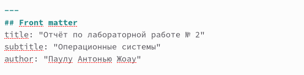{ #fig:001 width=70%}

Обозначили цель лабораторной работы: (рис. [-@fig:002]) 

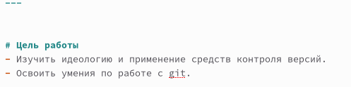{ #fig:002 width=70%}

Поставили задачи, кторые необходимо выполнить в ходе лабораторной работы. (рис. [-@fig:003])

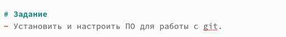{ #fig:003 width=70%}

В разделе "Выполнение лабораторной работы" подробно описали операции, реализуемые в ходе описываемой работы. (рис. [-@fig:004])

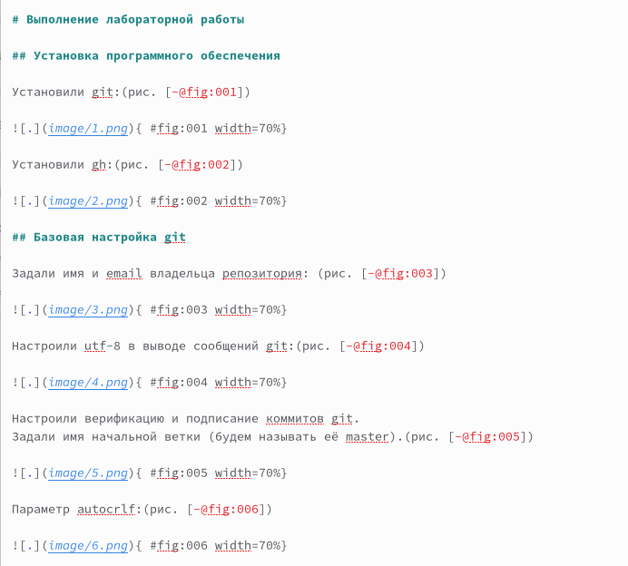{ #fig:004 width=70%}

Подвели итоги выполненной лабораторной работы. (рис. [-@fig:005])

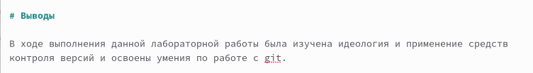{ #fig:005 width=70%}

В конце лаболатоной работы ответили на контрольные вопросы. (рис. [-@fig:006])

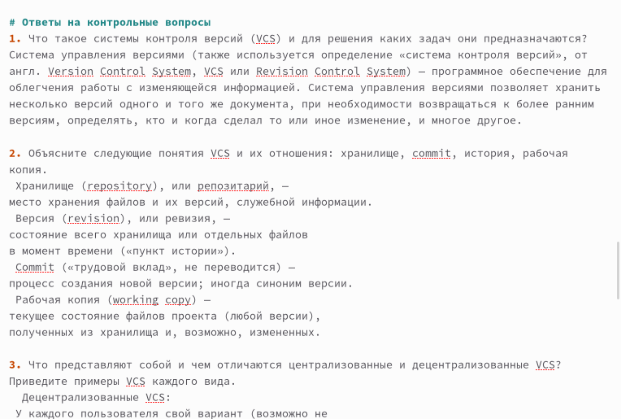{ #fig:006 width=70%}

## Техническая составляющая отчета

Для обработки файлов в формате Markdown использовали Pandoc. (рис. [-@fig:007], рис. [-@fig:008])

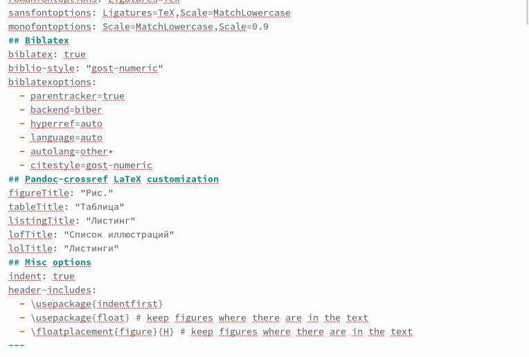{ #fig:007 width=70%}

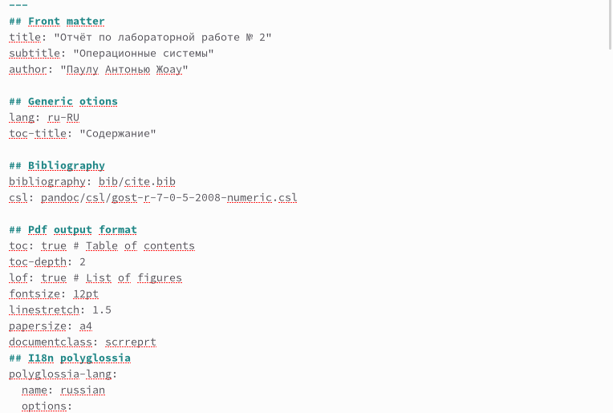{ #fig:008 width=70%}

Разделы "Цель работы", "Задание", "Выполнение лабораторной работы", "Выводы", "Ответы на контрольные вопросы" были отмечены как заголовки первого уровня (#) (рис. [-@fig:009]), а подразделы Выполнения лабораторной работы - как заголовки второго уровня (##).(рис. [-@fig:010])

{ #fig:009 width=70%}

{ #fig:010 width=70%}

Сслыка на изображение и его подпись. (рис. [-@fig:011])

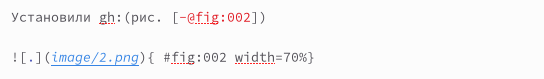{ #fig:011 width=70%}

Изображения распологаются в папке image, каталога с отчетом лаболаторной № 2. (рис [-@fig:012], [-@fig:013])

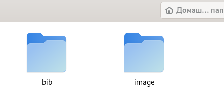{ #fig:012 width=70%}

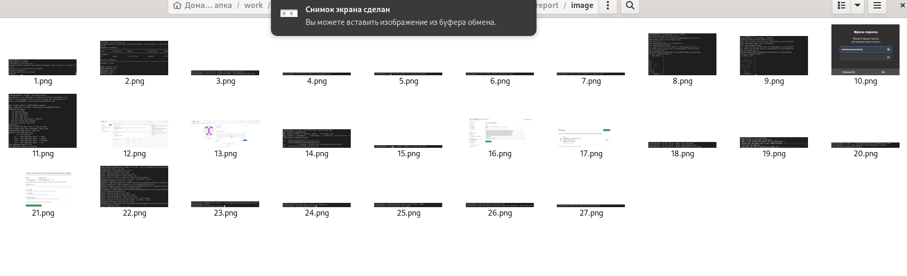{ #fig:013 width=70%}

Перешли в каталог отчета лабораторной работы № 2. (рис. [-@fig:014])

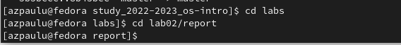{ #fig:014 width=70%}

С помощью команды make создали отчёт в формате pdf, docx. (рис. [-@fig:015], [-@fig:016])

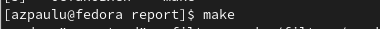{ #fig:015 width=70%}

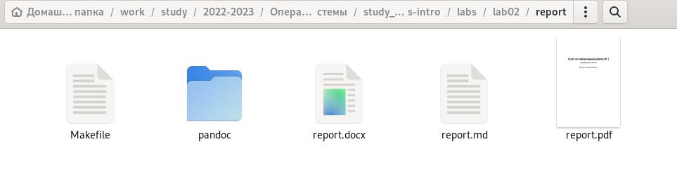{ #fig:016 width=70%}

# Выводы

В ходе выполнения лабораторной работы были изучены способы оформления отчётов с помощью легковесного языка разметки Markdown.

	
	
