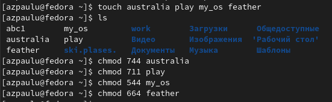
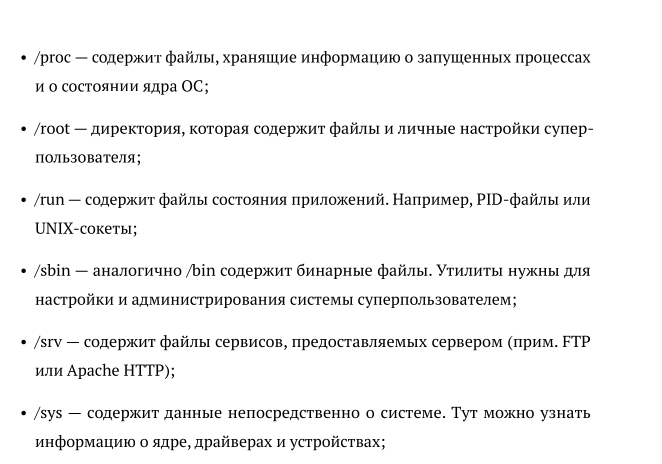

---
## Front matter
lang: ru-RU
title: Анализ файловой системы Linux. Команды для работы с файлами и каталогами
subtitle: Лабораторная работа №5
author:
  - Паулу А. Ж.
institute:
  - Российский университет дружбы народов, Москва, Россия

## i18n babel
babel-lang: russian
babel-otherlangs: english

## Formatting pdf
toc: false
toc-title: Содержание
slide_level: 2
aspectratio: 169
section-titles: true
theme: metropolis
header-includes:
 - \metroset{progressbar=frametitle,sectionpage=progressbar,numbering=fraction}
 - '\makeatletter'
 - '\beamer@ignorenonframefalse'
 - '\makeatother'
backgroundColor: orange
---

# Информация

## Докладчик

:::::::::::::: {.columns align=center}
::: {.column width="60%"}

  * Паулу Антонью Жоау
  * студент 1 курса, группа НММбд-02-22
  * Российский университет дружбы народов

:::
::: {.column width="40%"}

:::
::::::::::::::

# Вводная часть

## Объект и предмет исследования

- Файловая система
- Базовые команды работы с файловой системой

## Цель работы

- Ознакомление с файловой системой Linux, её структурой, именами и содержанием
каталогов. Приобретение практических навыков по применению команд для работы
с файлами и каталогами, по управлению процессами (и работами), по проверке использования диска и обслуживанию файловой системы.

## Задание
- Ознакомиться и разобрать на практике основные команды для работы с файловой системой Linux, её структурой, именами и содержанием
каталогов
- Выполнить упражнения
- Ответить на контрольные вопросы

# Выполнение лабораторной работы №4

## Команды для работы с файлами и каталогами

:::::::::::::: {.columns align=center}

::: {.column width="30%"}

:::

::: {.column width="30%"}

:::

::: {.column width="30%"}

:::

::::::::::::::

## Копирование, перемещение и переименование файлов и каталогов

:::::::::::::: {.columns align=center}

::: {.column width="30%"}

:::

::: {.column width="30%"}

:::

::: {.column width="30%"}

:::

::::::::::::::

## Копирование, перемещение и переименование файлов и каталогов

:::::::::::::: {.columns align=center}

::: {.column width="30%"}

:::

::: {.column width="30%"}

:::

::: {.column width="30%"}

:::

::::::::::::::

##  Права доступа

:::::::::::::: {.columns align=center}

::: {.column width="50%"}

:::

::: {.column width="50%"}

Создали нужные файлы. Определили опции команды chmod, необходимые для того, чтобы присвоить перечисленным ниже файлам выделенные права доступа, считая, что в начале таких прав нет. 

:::

::::::::::::::

## Выполнение упражнений

:::::::::::::: {.columns align=center}

::: {.column width="30%"}

:::

::: {.column width="30%"}

:::

::: {.column width="30%"}

:::

::::::::::::::

## Выполнение упражнений

:::::::::::::: {.columns align=center}

::: {.column width="30%"}

:::

::: {.column width="30%"}

:::

::: {.column width="30%"}

:::
::::::::::::::

## Команда man

:::::::::::::: {.columns align=center}

::: {.column width="30%"}

:::

::: {.column width="30%"}

:::

::: {.column width="30%"}

:::
::::::::::::::

## Ответы на контрольные вопросы

:::::::::::::: {.columns align=center}

::: {.column width="50%"}

:::

::: {.column width="50%"}

:::
::::::::::::::

# Результаты

## Выводы из лабораторной работы №4

В ходе выполнения лабораторной работы ознакомились с файловой системой Linux, её структурой, именами и содержанием
каталогов. Приобрели практические навыки по применению команд для работы
с файлами и каталогами, по управлению процессами (и работами), по проверке использования диска и обслуживанию файловой системы.

