---
## Front matter
title: "Отчёт по лабораторной работе № 5"
subtitle: "Анализ файловой системы Linux.
Команды для работы с файлами и каталогами"
author: "Паулу Антонью Жоау"

## Generic otions
lang: ru-RU
toc-title: "Содержание"

## Bibliography
bibliography: bib/cite.bib
csl: pandoc/csl/gost-r-7-0-5-2008-numeric.csl

## Pdf output format
toc: true # Table of contents
toc-depth: 2
lof: true # List of figures
fontsize: 12pt
linestretch: 1.5
papersize: a4
documentclass: scrreprt
## I18n polyglossia
polyglossia-lang:
  name: russian
  options:
	- spelling=modern
	- babelshorthands=true
polyglossia-otherlangs:
  name: english
## I18n babel
babel-lang: russian
babel-otherlangs: english
## Fonts
mainfont: PT Serif
romanfont: PT Serif
sansfont: PT Sans
monofont: PT Mono
mainfontoptions: Ligatures=TeX
romanfontoptions: Ligatures=TeX
sansfontoptions: Ligatures=TeX,Scale=MatchLowercase
monofontoptions: Scale=MatchLowercase,Scale=0.9
## Biblatex
biblatex: true
biblio-style: "gost-numeric"
biblatexoptions:
  - parentracker=true
  - backend=biber
  - hyperref=auto
  - language=auto
  - autolang=other*
  - citestyle=gost-numeric
## Pandoc-crossref LaTeX customization
figureTitle: "Рис."
tableTitle: "Таблица"
listingTitle: "Листинг"
lofTitle: "Список иллюстраций"
lolTitle: "Листинги"
## Misc options
indent: true
header-includes:
  - \usepackage{indentfirst}
  - \usepackage{float} # keep figures where there are in the text
  - \floatplacement{figure}{H} # keep figures where there are in the text
---

# Цель работы
Ознакомление с файловой системой Linux, её структурой, именами и содержанием
каталогов. Приобретение практических навыков по применению команд для работы
с файлами и каталогами, по управлению процессами (и работами), по проверке использования диска и обслуживанию файловой системы.

# Задание
- Ознакомиться и разобрать на практике основные команды для работы с файловой системой Linux, её структурой, именами и содержанием
каталогов
- Выполнить упражнения
- Ответить на контрольные вопросы

# Выполнение лабораторной работы

## Команды для работы с файлами и каталогами

Для создания текстового файла воспользовались командой touch (рис. [-@fig:001])

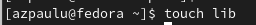{ #fig:001 width=70%}

Для просмотра файла небольшого размера можно воспользовались командой cat.(рис. [-@fig:002])

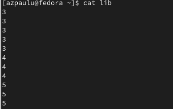{ #fig:002 width=70%}

Для просмотра файла постранично воспользовались командой less. (рис. [-@fig:003]), (рис. [-@fig:004])

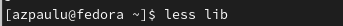{ #fig:003 width=70%}

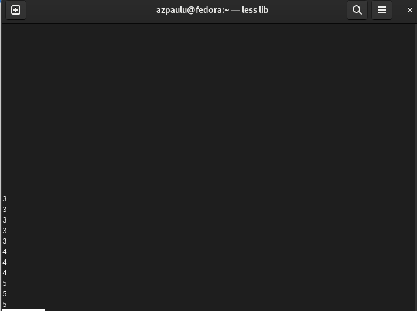{ #fig:004 width=70%}

Для просмотра первых 10 страниц файла воспользовались командой head. (рис. [-@fig:005])

{ #fig:005 width=70%}

Для просмотра последних 10 страниц файла воспользовались командой tail. (рис. [-@fig:006])

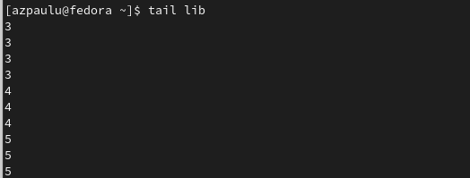{ #fig:006 width=70%}

##  Копирование, перемещение и переименование файлов и каталогов

Выполнили следующие действия, зафиксировав в отчёте по лабораторной работе
используемые при этом команды и результаты их выполнения:

1. Скопировали файл /usr/include/sys/io.h в домашний каталог и назвали его
equipment. (рис. [-@fig:007]), (рис. [-@fig:008])

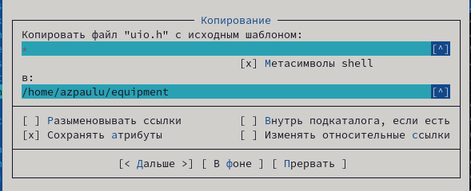{ #fig:007 width=70%}

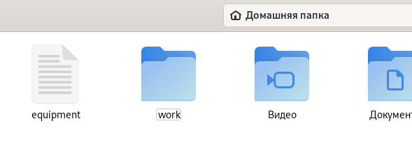{ #fig:008 width=70%}

2. В домашнем каталоге создали директорию ~/ski.plases. (рис. [-@fig:009]), (рис. [-@fig:010])

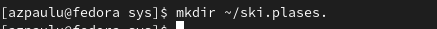{ #fig:009 width=70%}

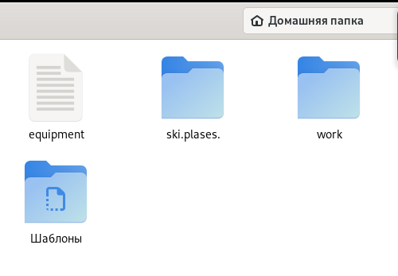{ #fig:010 width=70%}

3. Переместили файл equipment в каталог ~/ski.plases.(рис. [-@fig:011]), (рис. [-@fig:012])

{ #fig:011 width=70%}

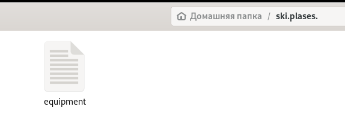{ #fig:012 width=70%}

4. Переименовали файл ~/ski.plases/equipment в ~/ski.plases/equiplist. (рис. [-@fig:013]), (рис. [-@fig:014])

{ #fig:013 width=70%}

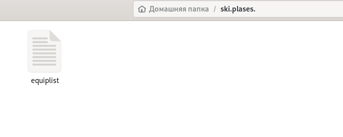{ #fig:014 width=70%}

5. Создали в домашнем каталоге файл abc1 и скопировали его в каталог
~/ski.plases, назвали его equiplist2. (рис. [-@fig:015]), (рис. [-@fig:016])

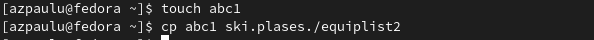{ #fig:015 width=70%}

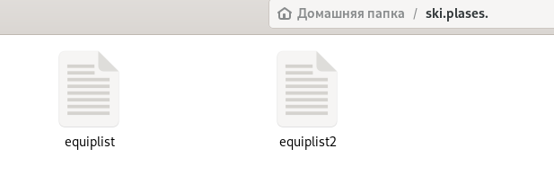{ #fig:016 width=70%}

6. Создали каталог с именем equipment в каталоге ~/ski.plases. (рис. [-@fig:017]), (рис. [-@fig:018])

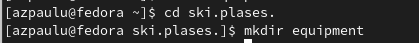{ #fig:017 width=70%}

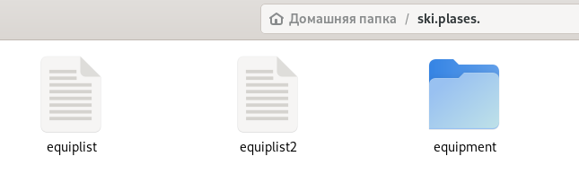{ #fig:018 width=70%}

7. Переместите файлы ~/ski.plases/equiplist и equiplist2 в каталог
~/ski.plases/equipment. (рис. [-@fig:019]), (рис. [-@fig:020])

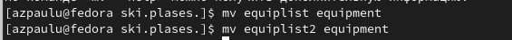{ #fig:019 width=70%}

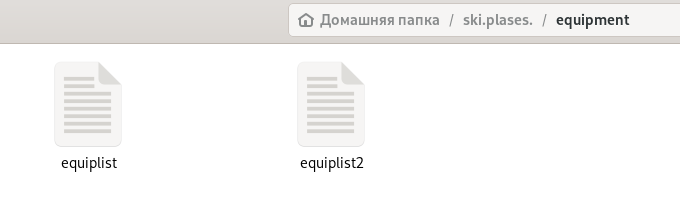{ #fig:020 width=70%}

8. Создали и переместили каталог ~/newdir в каталог ~/ski.plases и назвали
его plans. (рис. [-@fig:021]), (рис. [-@fig:022]), (рис. [-@fig:023])

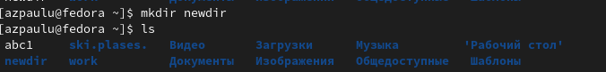{ #fig:021 width=70%}

{ #fig:022 width=70%}

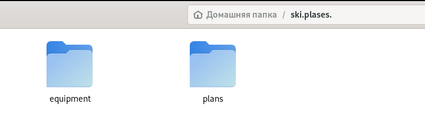{ #fig:023 width=70%}

##  Права доступа

Создали нужные файлы. Определили опции команды chmod, необходимые для того, чтобы присвоить перечисленным ниже файлам выделенные права доступа, считая, что в начале таких прав нет. (рис. [-@fig:024])
1. drwxr--r-- ... australia
2. drwx--x--x ... play
3. -r-xr--r-- ... my_os
4. -rw-rw-r-- ... feathers

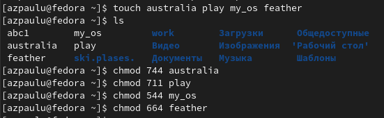{ #fig:024 width=70%}

## Выполнение упражнений

Проделали приведённые ниже упражнения, записывая в отчёт по лабораторной
работе используемые при этом команды:

1. Просмотрели содержимое файла /etc/passwd. (рис. [-@fig:025])

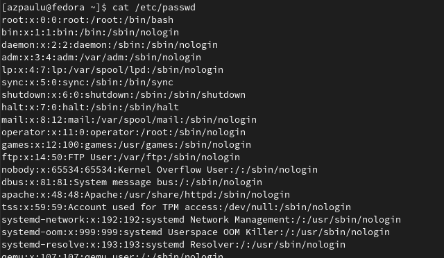{ #fig:025 width=70%}

2. Скопировали файл ~/feathers в файл ~/file.old. (рис. [-@fig:026])

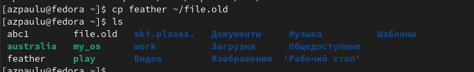{ #fig:026 width=70%}

3. Переместили файл ~/file.old в каталог ~/play. (рис. [-@fig:027])

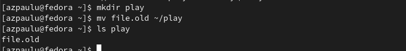{ #fig:027 width=70%}

4. Скопировали каталог ~/play в каталог ~/fun. (рис. [-@fig:028])

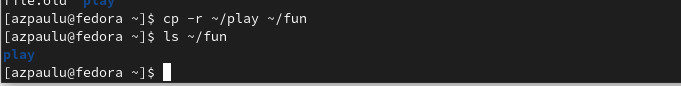{ #fig:028 width=70%}

5. Переместили каталог ~/fun в каталог ~/play и назвали его games. (рис. [-@fig:029])

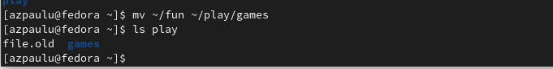{ #fig:029 width=70%}

6. Лишили владельца файла ~/feather права на чтение. (рис. [-@fig:030])

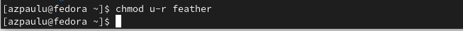{ #fig:030 width=70%}

7. Попытались просмотреть файл ~/feather командой
cat, получили отказ в доступе. (рис. [-@fig:031])

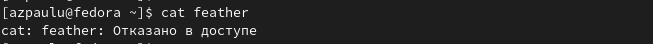{ #fig:031 width=70%}

8. Попытались скопировать файл ~/feather, получили отказ в доступе. (рис. [-@fig:032])

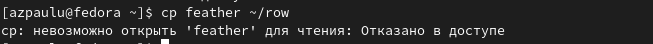{ #fig:032 width=70%}

9. Дали владельцу файла ~/feathers право на чтение. (рис. [-@fig:033])

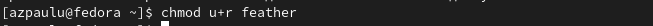{ #fig:033 width=70%}

10. Лишили владельца каталога ~/play права на выполнение. (рис. [-@fig:034])

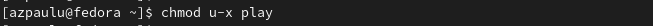{ #fig:034 width=70%}

11. Попытались перейти в каталог ~/play, получили отказ в доступе. (рис. [-@fig:035])

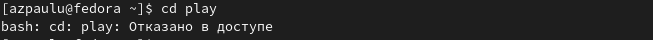{ #fig:035 width=70%}

12. Дали владельцу каталога ~/play право на выполнение. (рис. [-@fig:036])

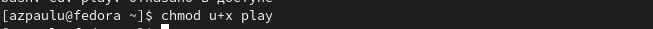{ #fig:036 width=70%}

## Команда man

 Прочитали man по командам mount, fsck, mkfs, kill и кратко их охарактеризовали.
 
 Команда mount используется для монтирования файловой системы в Linux, её также можно использовать для монтирования образа ISO, монтирования удалённой файловой системы Linux и многого другого. (рис. [-@fig:037])

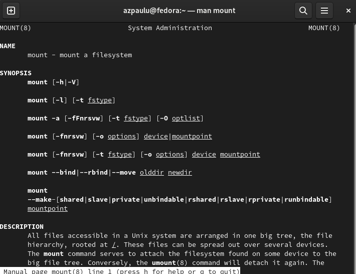{ #fig:037 width=70%}

fsck используется для проверки и, при необходимости, для восстановления файловых систем Linux, она также может печатать тип файловой системы на указанных разделах диска. (рис. [-@fig:038])

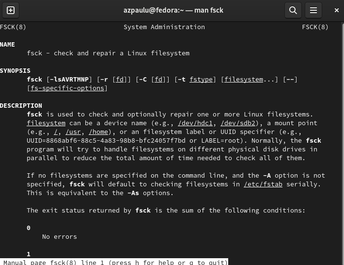{ #fig:038 width=70%}

Буквы в mkfs означают «make file system» (создать файловую систему). Команда обычно используется для управления устройствами хранения в Linux. Отвечает за создание файловых систем. (рис. [-@fig:039])

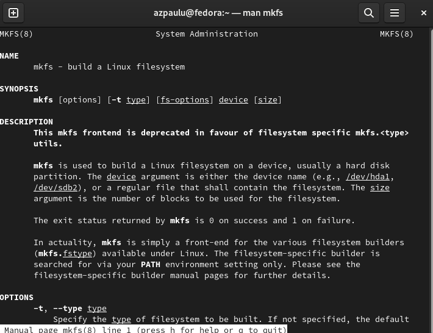{ #fig:039 width=70%}

Команда kill предназначена для посылки сигнала процессу. По умолчанию, если мы не указываем какой сигнал посылать, посылается сигнал SIGTERM (от слова termination — завершение). SIGTERM указывает процессу на то, что необходимо завершиться. (рис. [-@fig:040])

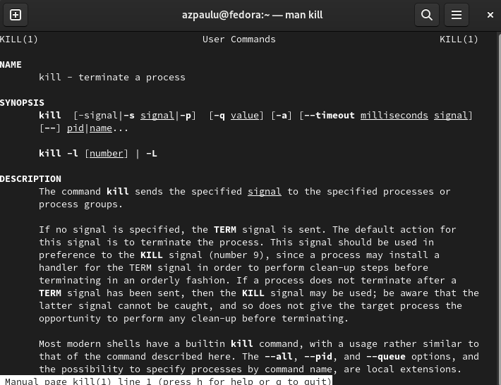{ #fig:040 width=70%}

# Выводы

В ходе выполнения лабораторной работы ознакомились с файловой системой Linux, её структурой, именами и содержанием
каталогов. Приобрели практические навыки по применению команд для работы
с файлами и каталогами, по управлению процессами (и работами), по проверке использования диска и обслуживанию файловой системы.

# Ответы на контрольные вопросы

1. Дайте характеристику каждой файловой системе, существующей на жёстком диске
компьютера, на котором вы выполняли лабораторную работу. (рис. [-@fig:041])

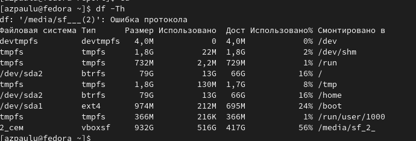{ #fig:041 width=70%}

2. Приведите общую структуру файловой системы и дайте характеристику каждой директории первого уровня этой структуры.

- / — root каталог. Содержит в себе всю иерархию системы;

- /bin — здесь находятся двоичные исполняемые файлы. Основные общие команды, хранящиеся отдельно от других программ в системе (прим.: pwd, ls, cat, ps);

- /boot — тут расположены файлы, используемые для загрузки системы (образ initrd, ядро vmlinuz);

- /dev — в данной директории располагаются файлы устройств (драйверов). С помощью этих файлов можно взаимодействовать с устройствами. К примеру, если это жесткий диск, можно подключить его к файловой системе. В файл принтера же можно написать напрямую и отправить задание на печать;

- /etc — в этой директории находятся файлы конфигураций программ. Эти файлы позволяют настраивать системы, сервисы, скрипты системных демонов;

- /home — каталог, аналогичный каталогу Users в Windows. Содержит домашние каталоги учетных записей пользователей (кроме root). При создании нового пользователя здесь создается одноименный каталог с аналогичным именем и хранит личные файлы этого пользователя;

- /lib — содержит системные библиотеки, с которыми работают программы и модули ядра;

- /lost+found — содержит файлы, восстановленные после сбоя работы системы. Система проведет проверку после сбоя и найденные файлы можно будет посмотреть в данном каталоге;

- /media — точка монтирования внешних носителей. Например, когда вы вставляете диск в дисковод, он будет автоматически смонтирован в директорию /media/cdrom;

- /mnt — точка временного монтирования. Файловые системы подключаемых устройств обычно монтируются в этот каталог для временного использования;

- /opt — тут расположены дополнительные (необязательные) приложения. Такие программы обычно не подчиняются принятой иерархии и хранят свои файлы в одном подкаталоге (бинарные, библиотеки, конфигурации);

- /proc — содержит файлы, хранящие информацию о запущенных процессах и о состоянии ядра ОС;

- /root — директория, которая содержит файлы и личные настройки суперпользователя;

- /run — содержит файлы состояния приложений. Например, PID-файлы или UNIX-сокеты;

- /sbin — аналогично /bin содержит бинарные файлы. Утилиты нужны для настройки и администрирования системы суперпользователем;

- /srv — содержит файлы сервисов, предоставляемых сервером (прим. FTP или Apache HTTP);

- /sys — содержит данные непосредственно о системе. Тут можно узнать информацию о ядре, драйверах и устройствах;

- /tmp — содержит временные файлы. Данные файлы доступны всем пользователям на чтение и запись. Стоит отметить, что данный каталог очищается при перезагрузке;

- /usr — содержит пользовательские приложения и утилиты второго уровня, используемые пользователями, а не системой. Содержимое доступно только для чтения (кроме root). Каталог имеет вторичную иерархию и похож на корневой;

- /var — содержит переменные файлы. Имеет подкаталоги, отвечающие за отдельные переменные. Например, логи будут храниться в /var/log, кэш в /var/cache, очереди заданий в /var/spool/ и так далее.

3. Какая операция должна быть выполнена, чтобы содержимое некоторой файловой
системы было доступно операционной системе? (Монтирование тома)

4. Назовите основные причины нарушения целостности файловой системы. Как устранить повреждения файловой системы?

Отсутствие синхронизации между образом файловой системы в памяти и ее данными на диске в случае аварийного останова может привести к появлению следующих ошибок:

- Один блок адресуется несколькими mode (принадлежит нескольким файлам).

- Блок помечен как свободный, но в то же время занят (на него ссылается onode).

- Блок помечен как занятый, но в то же время свободен (ни один inode на него не ссылается).

- Неправильное число ссылок в inode (недостаток или избыток ссылающихся записей в каталогах).

- Несовпадение между размером файла и суммарным размером адресуемых inode блоков.

- Недопустимые адресуемые блоки (например, расположенные за пределами файловой системы).

- "Потерянные" файлы (правильные inode, на которые не ссылаются записи каталогов).

- Недопустимые или неразмещенные номера inode в записях каталогов.

5. Как создаётся файловая система?

	mkfs - позволяет создать файловую систему Linux.

6. Дайте характеристику командам для просмотра текстовых файлов.

	Cat - выводит содержимое файла на стандартное устройство вывода

7. Приведите основные возможности команды cp в Linux.

	Cp – копирует или перемещает директорию, файлы.

8. Приведите основные возможности команды mv в Linux.

	Mv - переименовать или переместить файл или директорию

9. Что такое права доступа? Как они могут быть изменены?

	Права доступа к файлу или каталогу можно изменить, воспользовавшись командой chmod. Сделать это может владелец файла (или каталога) или пользователь с правами администратора.

	
	
