---
## Front matter
lang: ru-RU
title: Командная оболочка Midnight Commander
subtitle: Лабораторная работа №7
author:
  - Паулу А. Ж.
institute:
  - Российский университет дружбы народов, Москва, Россия

## i18n babel
babel-lang: russian
babel-otherlangs: english

## Formatting pdf
toc: false
toc-title: Содержание
slide_level: 2
aspectratio: 169
section-titles: true
theme: metropolis
header-includes:
 - \metroset{progressbar=frametitle,sectionpage=progressbar,numbering=fraction}
 - '\makeatletter'
 - '\beamer@ignorenonframefalse'
 - '\makeatother'
backgroundColor: orange
---

# Информация

## Докладчик

:::::::::::::: {.columns align=center}
::: {.column width="60%"}

  * Паулу Антонью Жоау
  * студент 1 курса, группа НММбд-02-22
  * Российский университет дружбы народов

:::
::: {.column width="40%"}

:::
::::::::::::::

# Вводная часть

## Объект и предмет исследования

- Midnight Commander
- Файлы и текстовые данные

## Цель работы

- Освоение основных возможностей командной оболочки Midnight Commander. Приобретение навыков практической работы по просмотру каталогов и файлов; манипуляций с ними.

## Задание
- Ознакомиться и разобрать на практике основные инструменты оболочки Midnight Commander.
- Выполнить упражнения.
- Ответить на контрольные вопросы.

# Выполнение лабораторной работы №7

## Задание по mc

:::::::::::::: {.columns align=center}

::: {.column width="30%"}

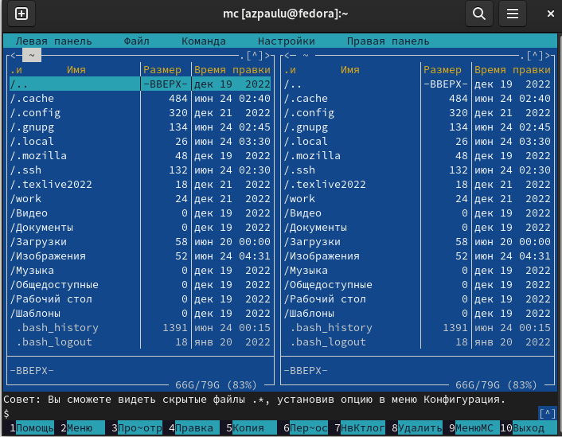

:::

::: {.column width="30%"}

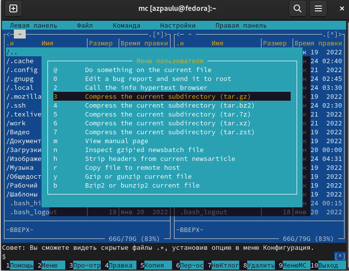

:::

::: {.column width="30%"}

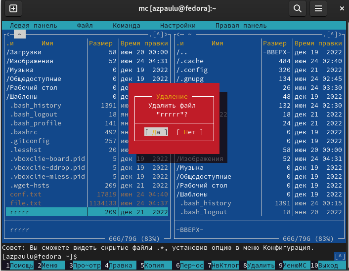

:::

::::::::::::::

## Задание по mc

:::::::::::::: {.columns align=center}

::: {.column width="30%"}

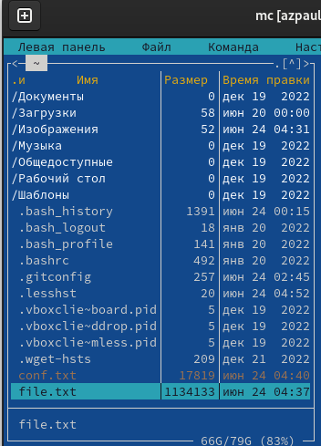

:::

::: {.column width="30%"}

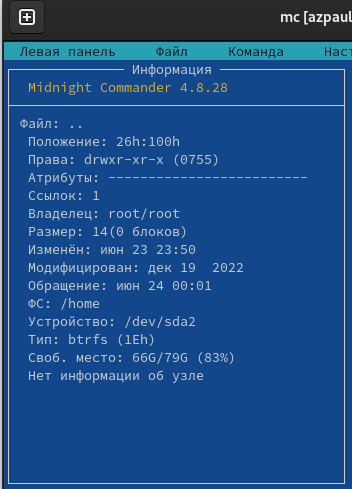

:::

::: {.column width="30%"}

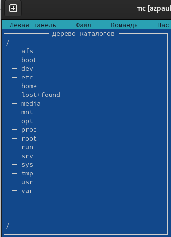

:::

::::::::::::::

## Задание по mc

:::::::::::::: {.columns align=center}

::: {.column width="30%"}

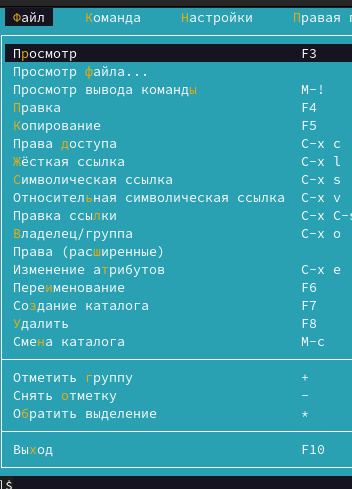

:::

::: {.column width="30%"}

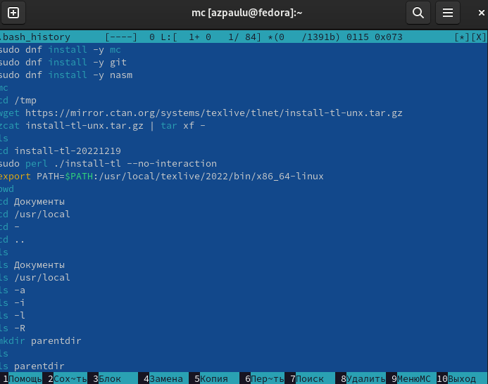

:::

::: {.column width="30%"}

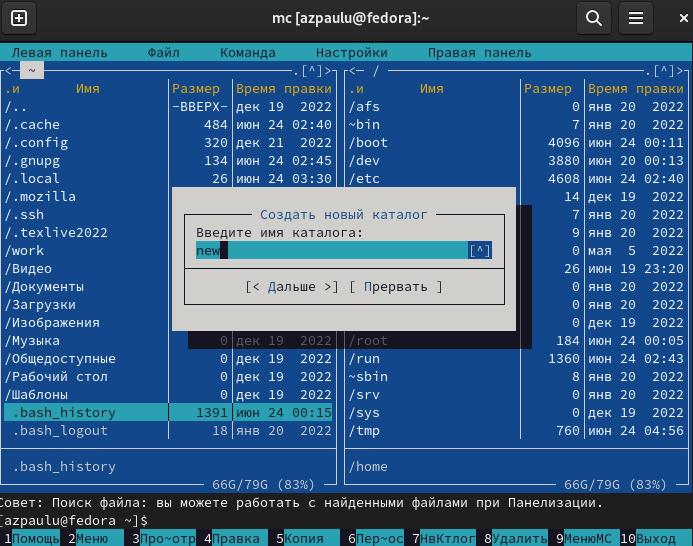

:::

::::::::::::::

## Задание по mc

:::::::::::::: {.columns align=center}

::: {.column width="30%"}

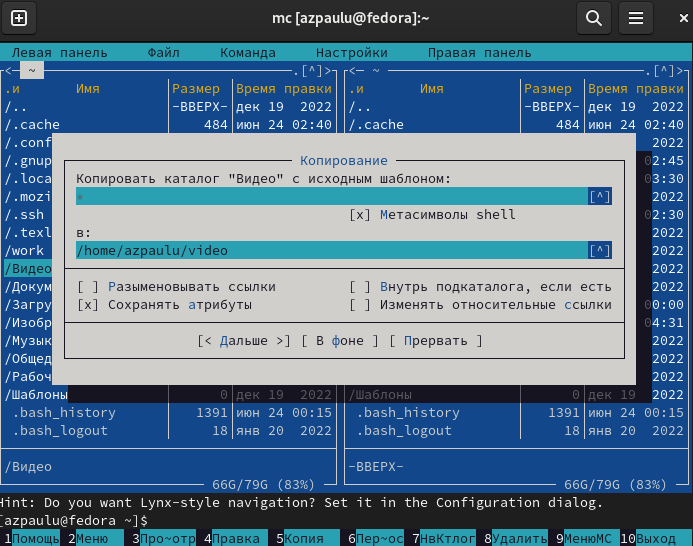

:::

::: {.column width="30%"}

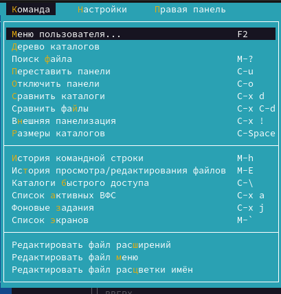

:::

::: {.column width="30%"}

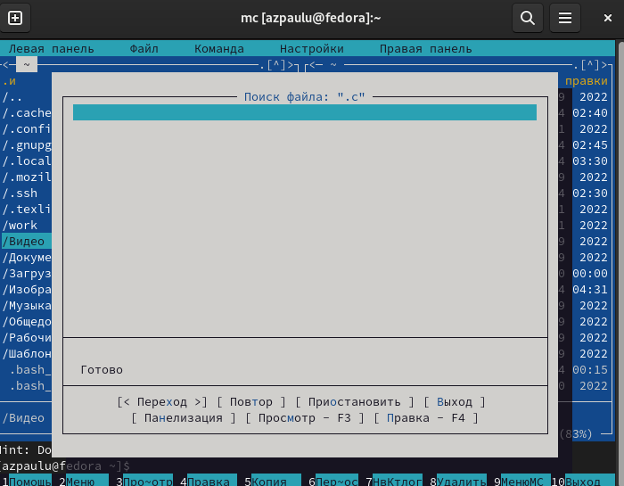

:::

::::::::::::::

## Задание по mc

:::::::::::::: {.columns align=center}

::: {.column width="30%"}

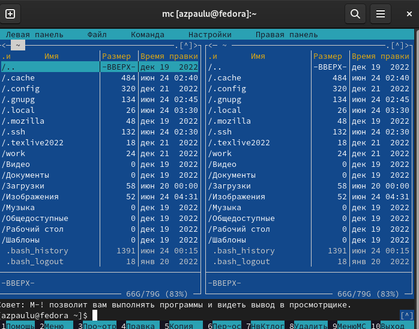

:::

::: {.column width="30%"}

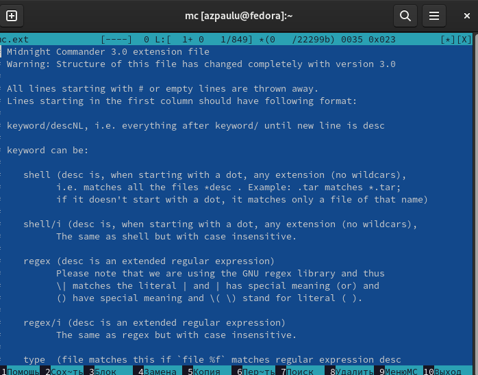

:::

::: {.column width="30%"}

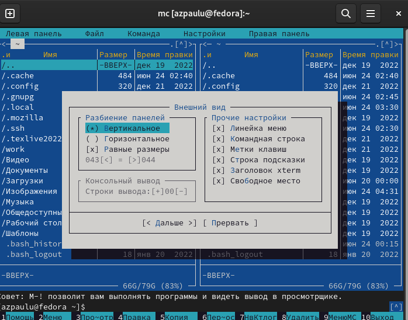

:::

::::::::::::::

## Задание по встроенному редактору mc

:::::::::::::: {.columns align=center}

::: {.column width="30%"}

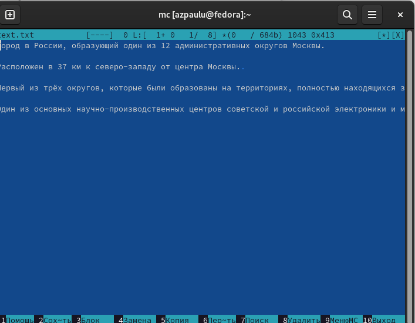

:::

::: {.column width="30%"}

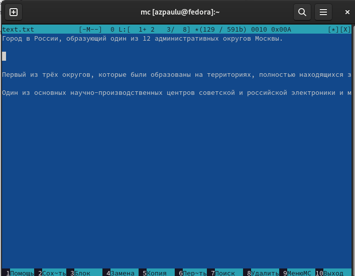

:::

::: {.column width="30%"}

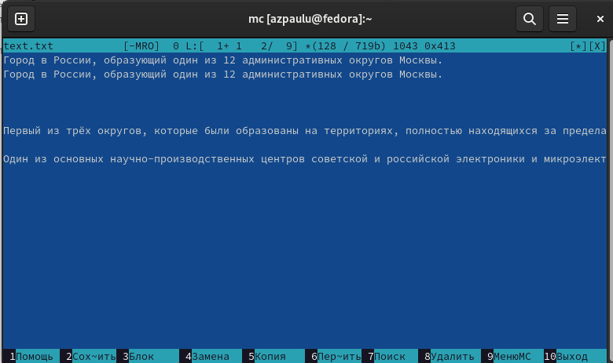

:::
::::::::::::::

## Задание по встроенному редактору mc

:::::::::::::: {.columns align=center}

::: {.column width="30%"}

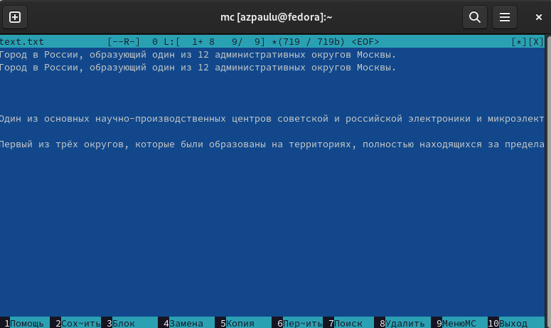

:::

::: {.column width="30%"}

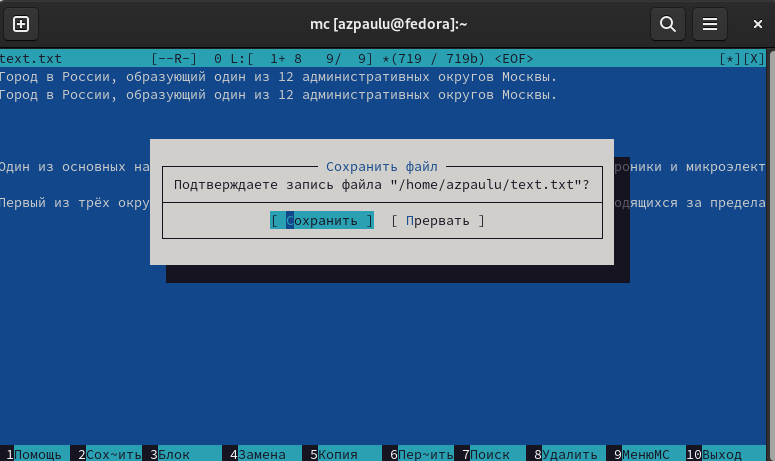

:::

::: {.column width="30%"}

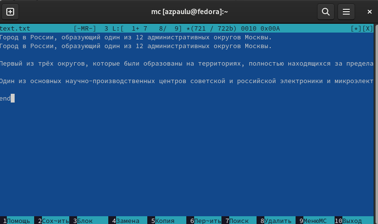

:::
::::::::::::::

## Задание по встроенному редактору mc

:::::::::::::: {.columns align=center}

::: {.column width="50%"}

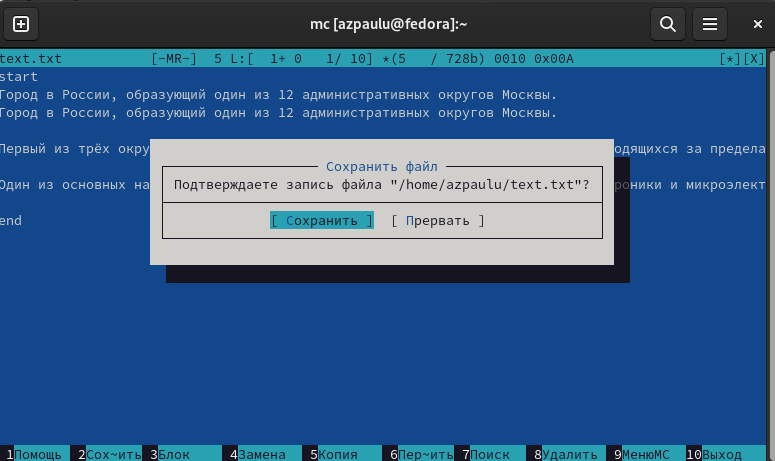

:::

::: {.column width="50%"}

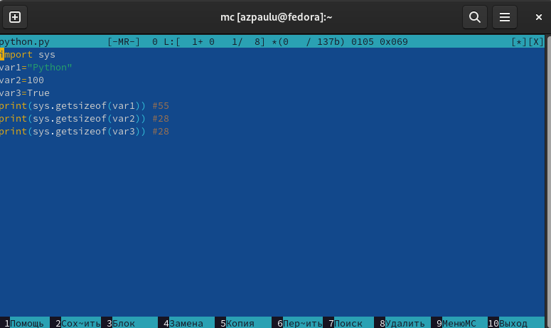

:::
::::::::::::::

## Ответы на контрольные вопросы

:::::::::::::: {.columns align=center}

::: {.column width="50%"}

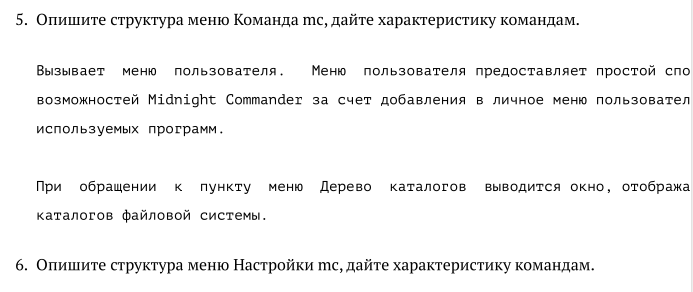

:::

::: {.column width="50%"}

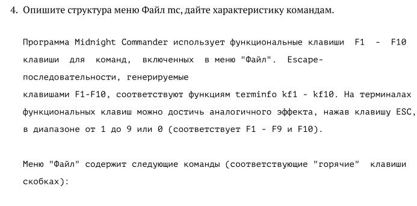

:::
::::::::::::::

# Результаты

## Выводы из лабораторной работы №7

В ходе выполнения лабораторной работы были освоены основные возможности командной оболочки Midnight Commander. Приобретены навыки практической работы по просмотру каталогов и файлов; манипуляций с ними.

